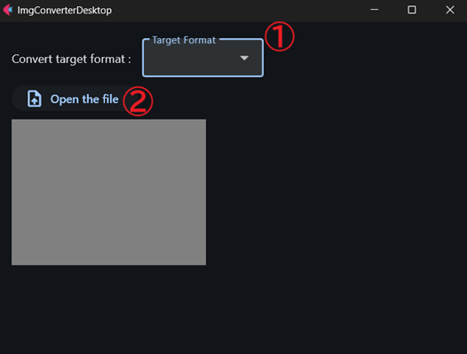
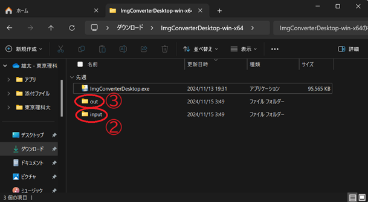

# ImgConverterDesktop
シンプルな画像形式変換アプリケーション。

あなたのデバイス上で簡単に画像形式の変換を行うことができます。

ImgConverterDesktop では、現在以下の画像形式への変換に対応しています。

* bmp
* eps
* gif
* ico
* jpg
* pdf
* png

これは、変換時に用いている Python ライブラリである Pillow がサポートしている画像形式です。

## Install
[Release](https://github.com/Yuulis/ImgConverterDesktop/releases) ページから最新のバージョンをダウンロードしてください。

なお、現在リリースされているのは Windows 向けのみです。

## How to Use
1.	Convert target format プルダウンメニューから, ご希望の変換形式を選択。
2.	Open the file ボタンを押下し, 変換したい画像を選択。または, input フォルダに直接画像をドラッグ&ドロップしてください。
3.	インストール時に展開したフォルダの直下に生成されている out フォルダの中に, 変換後の画像が格納されています。お好きな場所に移動させてください。

