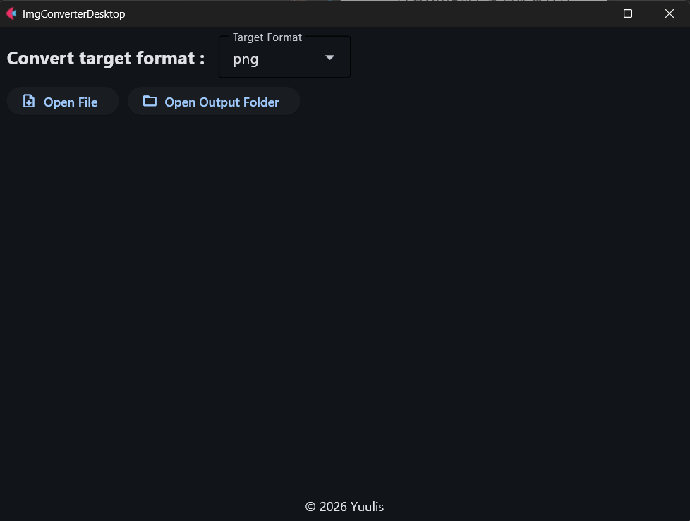

<h1 align="center">ImgConverterDesktop</h1>


<p align="center">


</p>

シンプルなデスクトップ向け画像形式変換アプリケーション

## 機能

- PNG / JPEG / WebP / TIFF / GIF / BMP / PDF / ICO / EPS など 24 以上のフォーマットに対応。
- `pillow-heif` による HEIC/HEIF 形式もサポート。
- 変換元・変換先の形式・画像サイズ・ファイルサイズを表示するサムネイルプレビュー。
- アプリ上から変換後の画像に直接アクセス可能。
- Windows / Mac OS / Linux で動作するクロスプラットフォーム対応。

## インストール

1. [Releases](https://github.com/Yuulis/ImgConverterDesktop/releases) ページから、お使いのOSに適した最新のリリースを Zip 形式でダウンロード。
2. ダウンロードした Zip ファイルを解凍し、生成されたフォルダ内の実行ファイル `imgconverterdesktop.exe` を起動。

## 使い方



1. まずは変換形式をプルダウンメニューから選択。
2. 「Open File」ボタンを押して、変換したい画像ファイルを選択(複数選択可)。
3. 画像選択後、自動的に変換が開始され、サムネイルプレビューに変換前・変換後の画像が表示されます。
4. 「Open Output Folder」ボタンを押して、変換後の画像が保存されるフォルダにアクセス可能。

## プロジェクト構成

このアプリは [Flet](https://flet.dev/) ライブラリを使用して作成されました。

```
ImgConverterDesktop/
├── src/
│   ├── main.py        # GUI エントリーポイント
│   ├── utils.py       # 画像変換ロジック
│   └── assets/
│       └── icon.png   # アプリアイコン
├── tests/
│   ├── test_utils.py
│   └── test_convert.py
├── input/             # 変換元画像（自動生成）
├── output/            # 変換後画像（自動生成）
├── pyproject.toml
└── LICENSE
```

## ライセンス

このプロジェクトは [MIT ライセンス](LICENSE) のもとで公開されています。
